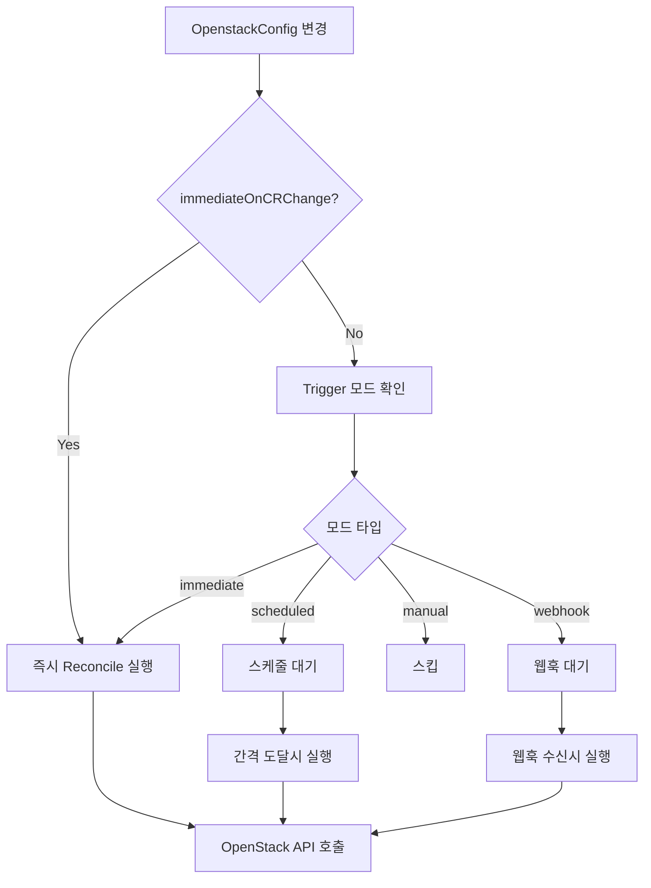

# MultiNic - Kubernetes Network Controller

MultiNic은 OpenStack 네트워크와 Kubernetes 클러스터를 통합하는 고성능 네트워크 컨트롤러입니다.

## 🚀 주요 기능

- **OpenStack 통합**: OpenStack 컴퓨트와 네트워크 서비스와 완전 통합
- **데이터베이스 관리**: MariaDB를 통한 네트워크 상태 영속화
- **성능 최적화**: 연결 풀링, HTTP 클라이언트 최적화, 캐싱
- **모니터링**: Prometheus 메트릭 지원
- **헬스체크**: 실시간 데이터베이스 연결 상태 모니터링
- **보안**: 비밀번호 암호화, 최소 권한 원칙

## 📋 요구사항

- Kubernetes v1.19+
- Go 1.24+
- OpenStack (Nova, Neutron)
- MariaDB 10.3+

## 🛠️ 설치

### 1. 소스에서 빌드

```bash
git clone https://github.com/xormsdhkdwk/multinic.git
cd multinic

# 의존성 설치
go mod download

# 빌드
make build

# 테스트
make test
```

### 2. Docker 이미지 빌드

```bash
# 최적화된 Docker 이미지 빌드
make docker-build IMG=multinic:v1alpha1

# 멀티 아키텍처 빌드
make docker-buildx IMG=multinic:v1alpha1
```

### 3. Kubernetes 배포

```bash
# CRD 설치
make install

# 데이터베이스 시크릿 생성
kubectl apply -f config/manager/db-secret.yaml

# 컨트롤러 배포
make deploy IMG=multinic:v1alpha1
```

## ⚙️ 설정

### 환경 변수

| 변수명 | 기본값 | 설명 |
|--------|--------|------|
| `DB_HOST` | `110.0.0.101` | 데이터베이스 호스트 |
| `DB_PORT` | `30306` | 데이터베이스 포트 |
| `DB_USER` | `root` | 데이터베이스 사용자 |
| `DB_PASSWORD` | - | 데이터베이스 비밀번호 (시크릿) |
| `DB_NAME` | `multinic` | 데이터베이스 이름 |

### OpenstackConfig 예제

```yaml
apiVersion: multinic.example.com/v1alpha1
kind: OpenstackConfig
metadata:
  name: openstack-config
spec:
  vmNames:
    - "test-vm-1"
    - "test-vm-2"
    - "test-vm-3"
  subnetName: "k8s-subnet"
  credentials:
    authURL: "http://110.0.0.100:5000"
    username: "admin"
    password: "admin"
    projectID: "your-project-id"
    domainName: "Default"
    networkEndpoint: "http://110.0.0.100:9696"
    computeEndpoint: "http://110.0.0.100:8774"
```

## 🎯 Reconcile Trigger 설정

MultiNic은 유연한 reconcile 트리거 시스템을 제공합니다. MultiNicOperator CR의 `reconcileTrigger` 설정으로 OpenStack API 호출 패턴을 제어할 수 있습니다.

### 🔄 Trigger 모드

| 모드 | 설명 | 사용 사례 |
|------|------|-----------|
| `immediate` | 모든 변경에 즉시 응답 (기본값) | 개발 환경, 실시간 동기화 필요 |
| `scheduled` | 정해진 간격으로만 reconcile | 운영 환경, API 호출 제한 |
| `manual` | OpenstackConfig CR 변경시만 | 수동 관리, 최소 API 호출 |
| `webhook` | 웹훅 트리거 기반 | 외부 시스템 연동 |

### ⚡ Immediate 모드 (기본값)

```yaml
apiVersion: multinic.example.com/v1alpha1
kind: MultiNicOperator
metadata:
  name: immediate-operator
  namespace: multinic-system
spec:
  # ... other configs ...
  reconcileTrigger:
    mode: "immediate"
    immediateOnCRChange: true
```

**특징:**
- 모든 변경사항에 즉시 응답
- 최고의 동기화 성능
- 높은 API 호출 빈도

### ⏰ Scheduled 모드

```yaml
apiVersion: multinic.example.com/v1alpha1
kind: MultiNicOperator
metadata:
  name: scheduled-operator
  namespace: multinic-system
spec:
  # ... other configs ...
  reconcileTrigger:
    mode: "scheduled"
    interval: "15m"  # 15분마다 reconcile
    immediateOnCRChange: true  # CR 변경시에는 즉시 실행
    timezone: "UTC"
```

**특징:**
- 정해진 간격으로만 OpenStack API 호출
- OpenstackConfig CR 변경시에는 즉시 응답 (immediateOnCRChange=true)
- API 호출 빈도 제어로 시스템 부하 감소

### 🎮 Manual 모드

```yaml
apiVersion: multinic.example.com/v1alpha1
kind: MultiNicOperator
metadata:
  name: manual-operator
  namespace: multinic-system
spec:
  # ... other configs ...
  reconcileTrigger:
    mode: "manual"
    immediateOnCRChange: true  # CR 변경시만 실행
```

**특징:**
- OpenstackConfig 생성/수정/삭제시만 reconcile
- 주기적 reconcile 없음
- 최소한의 API 호출

### 🌐 Webhook 모드

```yaml
apiVersion: multinic.example.com/v1alpha1
kind: MultiNicOperator
metadata:
  name: webhook-operator
  namespace: multinic-system
spec:
  # ... other configs ...
  reconcileTrigger:
    mode: "webhook"
    immediateOnCRChange: true
```

**특징:**
- 외부 웹훅으로 reconcile 트리거
- OpenstackConfig CR 변경시에는 즉시 응답
- 외부 시스템과의 연동에 적합

### 📊 동작 방식



### 🛠️ 실제 사용 예시

#### 개발 환경
```yaml
reconcileTrigger:
  mode: "immediate"
  immediateOnCRChange: true
```

#### 운영 환경 (부하 제어)
```yaml
reconcileTrigger:
  mode: "scheduled"
  interval: "30m"
  immediateOnCRChange: true
```

#### 유지보수 환경
```yaml
reconcileTrigger:
  mode: "manual"
  immediateOnCRChange: true
```

### 📝 로그 모니터링

Reconcile trigger 동작은 로그로 확인할 수 있습니다:

```bash
# Trigger 설정 확인
kubectl logs -f deployment/multinic-controller -n multinic-system | grep "trigger"

# 예시 로그 출력:
# "Proceeding with reconcile" mode="scheduled" isCRChangeEvent=true
# "Reconcile skipped due to trigger configuration" mode="manual" isCRChangeEvent=false
# "Immediate reconcile triggered by CR change event"
# "Reconcile completed successfully" triggerMode="scheduled" nextRequeue="15m"
```

### ⚠️ 중요 사항

1. **CR 변경시 즉시 처리**: `immediateOnCRChange: true`이면 모든 모드에서 CR 변경시 즉시 reconcile
2. **Hash 기반 변경 감지**: 실제 변경사항이 있을 때만 OpenStack API 호출
3. **모드별 Requeue 간격**: 각 모드에 따라 다음 reconcile 시점 자동 조정
4. **기본값 제공**: 설정이 없으면 immediate 모드로 동작

## 📊 모니터링

### Prometheus 메트릭

- `multinic_openstack_request_duration_seconds`: OpenStack API 요청 지연시간
- `multinic_database_operation_duration_seconds`: 데이터베이스 작업 지연시간
- `multinic_reconcile_total`: 전체 reconcile 작업 수
- `multinic_active_db_connections`: 활성 데이터베이스 연결 수

### 헬스체크 엔드포인트

- `/healthz`: 전체 상태 확인
- `/readyz`: 준비 상태 확인
- `/metrics`: Prometheus 메트릭

## 🏗️ 아키텍처

```
┌─────────────────┐    ┌─────────────────┐    ┌─────────────────┐
│   Kubernetes    │    │   MultiNic      │    │   OpenStack     │
│   Cluster       │◄──►│   Controller    │◄──►│   APIs          │
└─────────────────┘    └─────────────────┘    └─────────────────┘
                                │
                                ▼
                       ┌─────────────────┐
                       │    MariaDB      │
                       │   Database      │
                       └─────────────────┘
```

## 🗄️ 데이터베이스 스키마

### multi_subnet 테이블
- CR 생명주기 추적 (`created_at`, `modified_at`, `deleted_at`)
- 서브넷 정보 저장 (`id`, `subnet_name`, `cidr`)

### multi_interface 테이블
- 네트워크 인터페이스 정보
- `multi_subnet`과 외래키 관계

### node_table 테이블
- 노드 정보 저장
- `multi_interface`와 외래키 관계

## 🧪 테스트

```bash
# 단위 테스트
make test

# 통합 테스트
make test-integration

# 커버리지 확인
make test-coverage
```

## 🔧 개발

### 로컬 개발 환경

```bash
# CRD 설치
make install

# 로컬에서 실행
make run
```

### 코드 품질

```bash
# 린팅
make lint

# 포매팅
make fmt

# 정적 분석
make vet
```

## 📝 라이센스

이 프로젝트는 Apache 2.0 라이센스 하에 제공됩니다. 자세한 내용은 [LICENSE](LICENSE) 파일을 참조하세요.

## 🤝 기여

기여를 환영합니다! 자세한 내용은 [CONTRIBUTING.md](CONTRIBUTING.md)를 참조하세요.

## 📞 지원

문제가 있거나 질문이 있으시면 GitHub Issues를 통해 문의해 주세요.

# MultiNic Kubernetes Operator

MultiNic은 OpenStack과 통합된 멀티 네트워크 인터페이스를 관리하는 Kubernetes Operator입니다. **Operator Pattern**을 통해 Controller와 Database를 안전하게 관리하고 보호합니다.

## 🏗️ 아키텍처

### Operator 기반 관리 시스템

```
┌─────────────────────────────────────────────────────────┐
│                Kubernetes Cluster                       │
│  ┌─────────────────────────────────────────────────────┐│
│  │            multinic-system Namespace               ││
│  │                                                     ││
│  │  ┌─────────────────────────────────────────────────┐ ││
│  │  │            MultiNic Operator                   │ ││
│  │  │         (관리자 파드)                           │ ││
│  │  │  • Controller와 DB 생명주기 관리               │ ││
│  │  │  • 보호 정책 적용                              │ ││
│  │  │  • 자동 복구 기능                              │ ││
│  │  └──┬──────────────────────────────────────────────┘ ││
│  │     │ manages & protects                             ││
│  │     ▼                                                ││
│  │  ┌─────────────────┐    ┌─────────────────────────┐ ││
│  │  │ MultiNic        │    │      MariaDB            │ ││
│  │  │ Controller      │◄──►│   (Protected)           │ ││
│  │  │ (Protected)     │    │   • StatefulSet         │ ││
│  │  │  • CRD 처리     │    │   • 10Gi Storage        │ ││
│  │  │  • OpenStack 연동│    │   • 자동 백업           │ ││
│  │  │  • 메트릭 수집   │    │                         │ ││
│  │  └─────────────────┘    └─────────────────────────┘ ││
│  └─────────────────────────────────────────────────────┘│
└─────────────────────────────────────────────────────────┘
```

### 보호 메커니즘

**🛡️ ValidatingWebhook**
- 보호된 리소스의 직접 수정 차단
- Operator에서만 관리 허용
- 실시간 변경 감지 및 차단

**🔐 RBAC 기반 권한 분리**
- Operator 전용 ServiceAccount
- 최소 권한 원칙 적용
- 관리 작업과 일반 작업 분리

**🏷️ Label 기반 식별**
- `multinic.example.com/protected=true`
- `multinic.example.com/managed-by-operator={name}`

## 🚀 빠른 시작

### 1. Operator 배포

```bash
# Operator 배포 (한 번만 실행)
./deploy-operator.sh
```

이 스크립트는 다음을 수행합니다:
- MultiNic Operator Docker 이미지 빌드
- CRD 설치
- Operator 배포
- RBAC 설정
- ValidatingWebhook 설정

### 2. 시스템 구성

```bash
# MultiNicOperator CR로 시스템 설정
kubectl apply -f - <<EOF
apiVersion: multinic.example.com/v1alpha1
kind: MultiNicOperator
metadata:
  name: production-system
  namespace: multinic-system
spec:
  controller:
    image: multinic:v1alpha1
    replicas: 2
    resources:
      cpu: "200m"
      memory: "256Mi"
  
  database:
    enabled: true
    image: mariadb:10.11
    storageSize: "20Gi"
    resources:
      cpu: "500m"
      memory: "512Mi"
  
  openstack:
    identityEndpoint: "http://110.0.0.101:5000/v3"
    networkEndpoint: "http://110.0.0.101:9696/v2.0"
    computeEndpoint: "http://110.0.0.101:8774/v2.1"
  
  protection:
    enableMutationPrevention: true
    enableAutoRecovery: true
EOF
```

## 🔧 Operator 관리

### 기본 명령어

```bash
# Operator 상태 확인
kubectl get multinicoperator -n multinic-system

# 관리되는 리소스 확인
kubectl get pods,svc,deployments -l multinic.example.com/protected=true -n multinic-system

# Operator 로그 확인
kubectl logs -f deployment/multinic-operator -n multinic-system

# 설정 변경
kubectl edit multinicoperator production-system -n multinic-system
```

### 보호 기능 테스트

```bash
# ❌ 직접 수정 시도 (차단됨)
kubectl edit deployment multinic-controller -n multinic-system
# Error: admission webhook "vprotection.multinic.example.com" denied the request

# ✅ Operator를 통한 수정 (허용됨)
kubectl patch multinicoperator production-system -n multinic-system --type='merge' -p='{"spec":{"controller":{"replicas":3}}}'
```

### 문제 해결

```bash
# Webhook 상태 확인
kubectl get validatingwebhookconfiguration

# 보호 라벨 확인
kubectl get pods -n multinic-system --show-labels

# Operator finalizer 문제 해결
kubectl patch multinicoperator production-system -n multinic-system --type='merge' -p='{"metadata":{"finalizers":[]}}'
```

## 📊 모니터링

### Prometheus 메트릭

Operator는 다음 메트릭을 제공합니다:

```
# Operator 관련 메트릭
multinic_operator_reconcile_total
multinic_operator_managed_resources_count
multinic_operator_protection_events_total

# Controller 메트릭
multinic_openstack_request_duration_seconds
multinic_database_operation_duration_seconds
multinic_reconcile_total
multinic_active_db_connections
```

### 헬스체크

```bash
# Operator 헬스체크
curl http://operator-pod:8082/healthz

# Controller 헬스체크  
curl http://controller-pod:8082/healthz

# Database 헬스체크
kubectl exec -it mariadb-0 -n multinic-system -- mysqladmin ping
```

## 🛠️ 고급 설정

### 외부 데이터베이스 사용

```yaml
apiVersion: multinic.example.com/v1alpha1
kind: MultiNicOperator
metadata:
  name: external-db-system
spec:
  database:
    enabled: false  # 내부 DB 비활성화
  
  controller:
    env:
    - name: DB_HOST
      value: "external-mariadb.example.com"
    - name: DB_PORT  
      value: "3306"
    - name: DB_USER
      valueFrom:
        secretKeyRef:
          name: external-db-secret
          key: username
    - name: DB_PASSWORD
      valueFrom:
        secretKeyRef:
          name: external-db-secret
          key: password
```

### 고가용성 설정

```yaml
spec:
  controller:
    replicas: 3
    resources:
      cpu: "500m"
      memory: "512Mi"
    
  database:
    enabled: true
    storageSize: "100Gi"
    resources:
      cpu: "1000m"
      memory: "1Gi"
    
  protection:
    enableMutationPrevention: true
    enableAutoRecovery: true
    allowedOperations:
    - "get"
    - "list" 
    - "watch"
```

## 🧹 정리

```bash
# 전체 시스템 정리
./cleanup-operator.sh

# 특정 MultiNicOperator만 삭제
kubectl delete multinicoperator production-system -n multinic-system
```

## 🔐 보안 고려사항

### 1. RBAC 최소 권한
- Operator는 필요한 리소스에만 접근
- ServiceAccount별 권한 분리
- ClusterRole과 Role 적절히 조합

### 2. Network Policies
```yaml
apiVersion: networking.k8s.io/v1
kind: NetworkPolicy
metadata:
  name: multinic-isolation
  namespace: multinic-system
spec:
  podSelector:
    matchLabels:
      app: multinic-controller
  policyTypes:
  - Ingress
  - Egress
  ingress:
  - from:
    - namespaceSelector:
        matchLabels:
          name: multinic-system
  egress:
  - to:
    - namespaceSelector: {}
    ports:
    - protocol: TCP
      port: 443  # Kubernetes API
  - to: []
    ports:
    - protocol: TCP
      port: 3306  # MariaDB
```

### 3. Pod Security Standards
```yaml
apiVersion: v1
kind: Namespace
metadata:
  name: multinic-system
  labels:
    pod-security.kubernetes.io/enforce: restricted
    pod-security.kubernetes.io/audit: restricted
    pod-security.kubernetes.io/warn: restricted
```

## 📋 API 레퍼런스

### MultiNicOperator CRD

```yaml
apiVersion: multinic.example.com/v1alpha1
kind: MultiNicOperator
spec:
  controller:
    image: string          # Controller 이미지
    replicas: int32        # 복제본 수
    resources:             # 리소스 요구사항
      cpu: string
      memory: string
    healthProbe:           # 헬스 프로브 설정
      port: int32
      path: string
  
  database:
    enabled: bool          # 내부 DB 사용 여부
    image: string          # DB 이미지
    storageSize: string    # 스토리지 크기
    resources:             # 리소스 요구사항
      cpu: string
      memory: string
    credentials:           # DB 인증 정보
      rootPassword: string
      database: string
      user: string
      password: string
  
  openstack:
    identityEndpoint: string    # Keystone URL
    networkEndpoint: string     # Neutron URL
    computeEndpoint: string     # Nova URL
  
  protection:
    enableMutationPrevention: bool     # 변경 방지 활성화
    enableAutoRecovery: bool           # 자동 복구 활성화
    allowedOperations: []string        # 허용된 작업 목록

status:
  phase: string                    # 전체 상태
  message: string                  # 상태 메시지
  lastUpdated: metav1.Time        # 마지막 업데이트
  controllerStatus:               # Controller 상태
    phase: string
    readyReplicas: int32
    desiredReplicas: int32
  databaseStatus:                 # Database 상태
    phase: string
    readyReplicas: int32
  protectionStatus:               # 보호 상태
    active: bool
    preventedMutations: int32
    lastProtectionEvent: metav1.Time
```

## 🤝 기여하기

1. Fork the repository
2. Create your feature branch (`git checkout -b feature/amazing-feature`)
3. Commit your changes (`git commit -m 'Add some amazing feature'`)
4. Push to the branch (`git push origin feature/amazing-feature`)
5. Open a Pull Request

## 📄 라이선스

This project is licensed under the Apache License 2.0 - see the [LICENSE](LICENSE) file for details.

## 📞 지원

- 🐛 버그 리포트: [GitHub Issues](https://github.com/xormsdhkdwk/multinic/issues)
- 💡 기능 요청: [GitHub Discussions](https://github.com/xormsdhkdwk/multinic/discussions)
- 📧 이메일: support@multinic.example.com

---

**🎯 MultiNic Operator로 안전하고 자동화된 멀티 네트워크 관리를 경험해보세요!**

